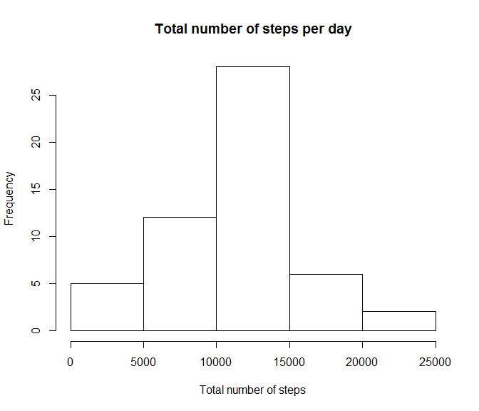
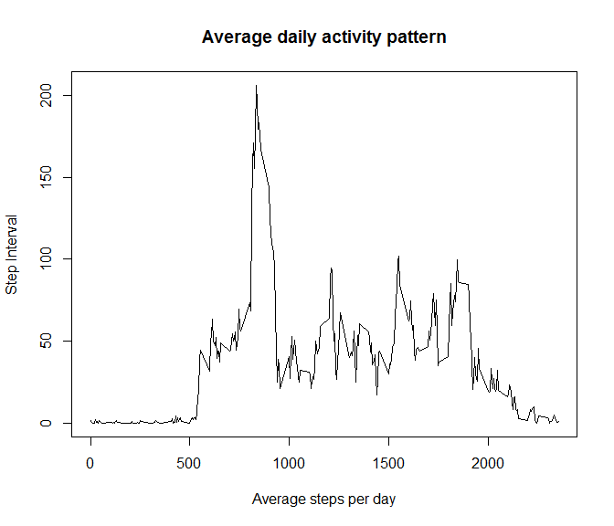
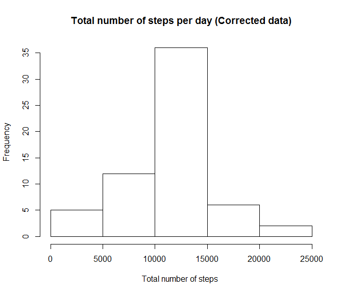
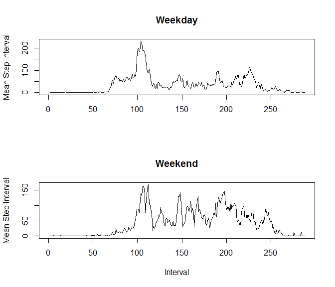

# Reproducible Research: Peer Assessment 1

## Loading and preprocessing the data
Unzip the data and read as csv file. 

```r
library("lattice", lib.loc="~/R/win-library/3.1") 
fname <- unzip("activity.zip")
data <- read.csv(fname, na.strings="NA")
```

## What is mean total number of steps taken per day?
 - Take the aggregate sum of steps and date. 
 - Create a hist plot of data. 

```r
plotdata <- aggregate(data$steps ~ data$date, FUN = sum)
hist(plotdata$'data$steps', xlab='Total number of steps', ylab='Frequency', main='Total number of steps per day')
```

 

Median value of total steps per day:

```r
mean(plotdata$'data$steps')
```

```
## [1] 10766.19
```
Mean value of total steps per day:

```r
median(plotdata$'data$steps')
```

```
## [1] 10765
```

## What is the average daily activity pattern?
 - Fix data with only completed cases
 - aggregate mean of steps and interval
 - plot the meandata of average daily pattern

```r
avgdata <- data[complete.cases(data),]
meandata <- aggregate(avgdata$steps ~ avgdata$interval, FUN = mean)
meandata <- setNames(meandata, c("Interval", "Steps"))
plot(meandata,type='l', ylab="Step Interval", xlab = "Average steps per day", main="Average daily activity pattern")
```

 

Interval with maximum number of average daily steps:

```r
meandata$Interval[meandata$Steps == max(meandata$Steps)]
```

```
## [1] 835
```

## Imputing missing values
 - Input missing values using the meandata. 
 - Take the meandata value for the specific interval and replace the NA val. 
 - Check before and after for total NA vals. 

```r
sum(is.na(data[,1]))
```

```
## [1] 2304
```

```r
missValData <- data
for(i in 1:nrow(missValData)){
  if (is.na(missValData[i,1]))
  {
    missValData[i,1] <- meandata[meandata$Interval == missValData[i,3],2]
  }
}
sum(is.na(missValData[,1]))
```

```
## [1] 0
```

New histogram of total steps per day with corrected data. 

```r
plotdataFixed <- aggregate(missValData$steps ~ missValData$date, FUN = sum)
hist(plotdataFixed$'missValData$steps', xlab='Total number of steps ', ylab='Frequency', main='Total number of steps per day (Corrected data)')
```

 

Corrected Median value of total steps per day:

```r
mean(plotdataFixed$'missValData$steps')
```

```
## [1] 10766.19
```
Corrected Mean value of total steps per day:

```r
median(plotdataFixed$'missValData$steps')
```

```
## [1] 10766.19
```

## Are there differences in activity patterns between weekdays and weekends?
  - Create factors for the days of the week and set to a new column. 
  - Subset the 'weekday' and 'weekend' data. 
  - Plot both the 'weekday' and 'weekend' in a frame. 

```r
missValData$daytype <- factor(weekdays(as.Date(missValData$date), abbreviate = TRUE), labels=c('weekday','weekday','weekday','weekday','weekday','weekend','weekend'), levels=c('Mon','Tue','Wed','Thu','Fri','Sat','Sun'))
wkData <- subset(missValData, missValData$daytype == 'weekday')
wkEndData <- subset(missValData, missValData$daytype == 'weekend')
par(mfrow=c(2,1))
plot(tapply(wkData$steps, wkData$interval, FUN = mean), type="l", ylab="Mean Step Interval", xlab="", main="Weekday")
plot(tapply(wkEndData$steps, wkEndData$interval, FUN = mean), type="l", ylab="Mean Step Interval", xlab="Interval", main="Weekend")
```

 
